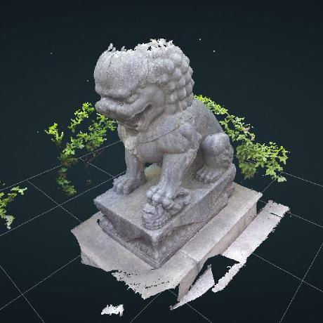
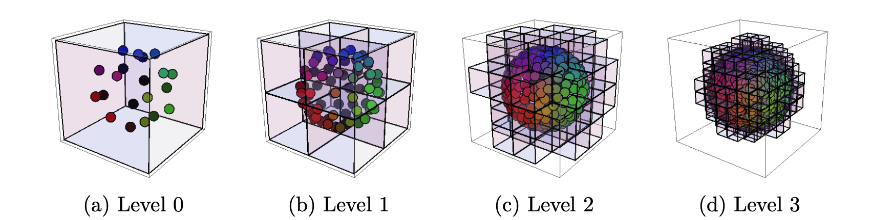
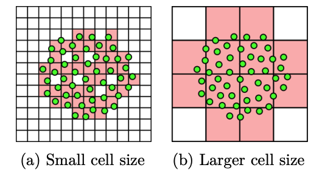
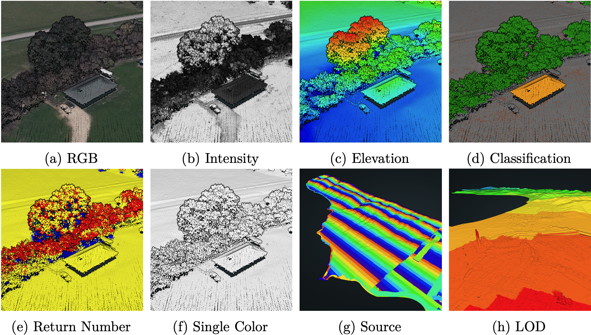

# Boden Study Sessions

Potree---WebGL point cloud viewer for large datasets

<div class="pt-12">
  <span @click="next" class="px-2 p-1 rounded cursor-pointer hover:bg-white hover:bg-opacity-10">
    Let's start learning <carbon:arrow-right class="inline"/>
  </span>
</div>

<BarBottom  title="BodenStudy dyf">
  <Item  text="potree" >
    <a href="https://github.com/potree/potree" target="_blank" alt="GitHub"
      class="!border-none"
    >
      <carbon:logo-github />
    </a>
  </Item>
    <Item text="dyf">
    <carbon:logo-twitter />
  </Item>
  <Item text="sli.dev">
    <carbon:link />
  </Item>
</BarBottom>

---
layout: intro
---

## 什么是点云?

<br />
<br />

<div class="grid grid-cols-2 gap-x-4">
<div>
<p class="text-xl">
点云( Point Cloud) 是空间中点的数据集，可以表示三维形状或对象，通常由三维扫描仪获取.

点云中每个点的位置都由一组笛卡尔坐标(X，Y，Z)描述，有些可能含有色彩资讯(R，G，B)或物体反射面强度(Intensity)信息.

强度信息的获取是激光扫描仪接受装置采集到的回波强度，此强度信息与目标的表面材质、粗糙度、入射角方向，以及仪器的发射能量，激光波长有关.
</p>
</div>
<div>


</div>
</div>

<BarBottom  title="BodenStudy dyf">
  <Item  text="potree" >
    <a href="https://github.com/potree/potree" target="_blank" alt="GitHub"
      class="!border-none"
    >
      <carbon:logo-github />
    </a>
  </Item>
    <Item text="dyf">
    <carbon:logo-twitter />
  </Item>
  <Item text="sli.dev">
    <carbon:link />
  </Item>
</BarBottom>

---
layout: intro
---

## 什么是WebGL?

<br />
<br />

<div class="grid grid-cols-2 gap-x-4">
<div>
<p class="text-xl">
WebGL（Web 图形库）是一个 JavaScript API，可在任何兼容的 Web 浏览器中渲染高性能的交互式 3D 和 2D 图形，而无需使用插件.

WebGL 通过引入一个与 OpenGL ES 2.0 非常一致的 API 来做到这一点，该 API 可以在 HTML5 canvas 元素中使用.

这种一致性使 API 可以利用用户设备提供的硬件图形加速.
</p>
</div>
<div>

### WebGl Example

```js {1-7|8|all}
/**
 * 要获得这个接口的对象以用于 2D 和 3D 的图形渲染，
 * 可以通过在 <canvas> 元素上调用 getContext() 函数，
 * 调用时传入“webgl”参数：
 */
const canvas = document.getElementById('myCanvas');
const gl = canvas.getContext('webgl');
gl.canvas; // HTMLCanvasElement

```

</div>
</div>

<BarBottom  title="BodenStudy dyf">
  <Item  text="potree" >
    <a href="https://github.com/potree/potree" target="_blank" alt="GitHub"
      class="!border-none"
    >
      <carbon:logo-github />
    </a>
  </Item>
    <Item text="dyf">
    <carbon:logo-twitter />
  </Item>
  <Item text="sli.dev">
    <carbon:link />
  </Item>
</BarBottom>

<!-- 
layout: intro


## `<BarBottom />` with custom icons/images

<br />
<br />

<div class="grid grid-cols-2 gap-x-4">
<div>

You can use your own icons/images if you want.

Only need to add an `<Item />` component and use `slots` features.

Also， you can use [Windi CSS](https://windicss.org/) to add style to the icon， for example， adjust the width o height.

</div>
<div>

### Slide example

```markdown
---
layout: intro
---

# Content

<BarBottom  title="Slidev theme purplin">
  <Item text="slidevjs/slidev">
    <carbon:logo-github />
  </Item>
  <Item text="Slidevjs">
    <carbon:logo-twitter />
  </Item>
  <Item text="sli.dev">
    
  </Item>
</BarBottom>
```

</div>
</div>

<BarBottom  title="Slidev theme purplin">
  <Item text="slidevjs/slidev">
    <carbon:logo-github />
  </Item>
  <Item text="Slidevjs">
    <carbon:logo-twitter />
  </Item>
  <Item text="sli.dev">
    
  </Item>
</BarBottom> -->

---
layout: intro
---

## Potree

<br />
<br />

<div class="grid grid-cols-2 gap-x-4">
<div>
<p class="text-xl">
一个基于网络的大型点云的渲染器.它允许用户在标准的网络浏览器中实时查看来自激光雷达或摄影测量等来源的具有数十亿点的数据集.

在网络浏览器中进行点云可视化的主要优势之一是它允许用户与客户分享他们的数据集，而不需要安装第三方应用程序和提前传输大量数据.

还允许用户使用Potree来查看、分析和验证原始点云数据.
</p>
<!-- <p v-after class="text-xl">
在网络浏览器中对数十亿个点进行流化和渲染，而不需要提前加载大量的数据，是通过一个分层结构实现的，该结构以不同的分辨率存储原始数据的子样本，低分辨率被存储在在根节点中，每一级的分辨率都会逐渐增加.

该结构允许Potree剔除点云中位于视图范围之外的区域，和以较低的细节水平渲染遥远的区域.
</p> -->
</div>
<div>



</div>
</div>

<BarBottom  title="BodenStudy dyf">
  <Item  text="potree" >
    <a href="https://github.com/potree/potree" target="_blank" alt="GitHub"
      class="!border-none"
    >
      <carbon:logo-github />
    </a>
  </Item>
    <Item text="dyf">
    <carbon:logo-twitter />
  </Item>
  <Item text="sli.dev">
    <carbon:link />
  </Item>
</BarBottom>

<style>
  ._img {
    width: 350px !important;
    height: 300px !important;
  }
</style>

---

# 今日份 Potree
  
-  **简 介** - Potree的由来
-  **数据结构** - 对所采用的可修改的嵌套八叉树模型的描述，该结构的建立以及它在渲染过程中如何被遍历.
-  **点云渲染** - 颜色和点尺寸的计算，以及高质量的渲染模式.
-  **实施和特点** - 涵盖了Javascript和WebGL的实现细节.并介绍了Potree的一些功能.
<!-- - 🎥 **Recording** - built-in recording and camera view
- 📤 **Portable** - export into PDF， PNGs， or even a hostable SPA
- 🛠 **Hackable** - anything possible on a webpage -->

<br>
<br>

论文出处 [SCHUETZ-2016-POT-thesis](https://www.cg.tuwien.ac.at/research/publications/2016/SCHUETZ-2016-POT/SCHUETZ-2016-POT-thesis.pdf)

<BarBottom  title="BodenStudy dyf">
  <Item  text="potree" >
    <a href="https://github.com/potree/potree" target="_blank" alt="GitHub"
      class="!border-none"
    >
      <carbon:logo-github />
    </a>
  </Item>
    <Item text="dyf">
    <carbon:logo-twitter />
  </Item>
  <Item text="sli.dev">
    <carbon:link />
  </Item>
</BarBottom>

---
layout: image-right
image: 'public/CHAPER1.png'
---

# 1 Introduction

概述

<p>
  点云是由点组成的三维模型，而不是更广泛使用的三角形模型.
  
  它们通常是通过各种扫描方法，如激光扫描和摄影测量，获得现实世界的数据.
  
  用例包括三维地图和地球的生成(如谷歌地图，Cesium)，追踪建筑进度或城市、森林或其他类型景观的变化，为游戏和电影生成三维资产，或捕捉运动和姿势.
</p>

<BarBottom  title="BodenStudy dyf">
  <Item  text="potree" >
    <a href="https://github.com/potree/potree" target="_blank" alt="GitHub"
      class="!border-none"
    >
      <carbon:logo-github />
    </a>
  </Item>
    <Item text="dyf">
    <carbon:logo-twitter />
  </Item>
  <Item text="sli.dev">
    <carbon:link />
  </Item>
</BarBottom>

---

## 1.1 Motivation

<br/>

<section>
  <p>
    为了向客户或感兴趣的观众展示这些模型，传统上需要传输大量的数据并安装第三方应用程序来查看.有时，数据必须通过邮寄硬盘来传输，因为它们需要大量的空间.
  </p>
  <p>
    随着WebGL的发布，通过网络浏览器发布3D内容已经变得越来越流行.它已经发展成为一个标准，所有主要的浏览器都支持它.甚至是移动设备都支持.现在，WebGL允许开发者、艺术家、公司、研究人员和其他方面的人分享他们的内容.而不需要安装额外的软件，无需了解任何关于底层的WebGL机制.
  </p>
  <p>
     在大多数情况下，其内容相对较小.在这种情况下，意味着完整的数据集适合在内存中，可以在合理的时间内下载，并且可以实时呈现.然而，有些类型的内容超出了这些要求.数据可能无法装入内存，或者下载全部数据需要几分钟甚至几小时.
  </p>
  <p>
    potree目标是开发一个能够流式传输和渲染数十亿点的点云数据集的浏览器，而不需要先传输整个数据集或安装第三方查看器.
  </p>
</section>


<BarBottom  title="BodenStudy dyf">
  <Item  text="potree" >
    <a href="https://github.com/potree/potree" target="_blank" alt="GitHub"
      class="!border-none"
    >
      <carbon:logo-github />
    </a>
  </Item>
    <Item text="dyf">
    <carbon:logo-twitter />
  </Item>
  <Item text="sli.dev">
    <carbon:link />
  </Item>
</BarBottom>

---

## 1.2 Problem Definition

<br/>

<section>
  <p>
    三维扫描技术，如激光扫描仪或摄影测量，产生巨大的数据量，通常超过数亿或数十亿个点，由于点数据的性质，即使是简单的模型，也需要大量的点来准确表示.例如，一堵平墙可以用一个四边形和一个纹理来表示，但可能需要成千上万的彩色点才能达到相同的效果.
  </p>
  <p>
    点云数据的主要挑战之一是数据集的处理和渲染，而这些数据集并不适合放在内存中.这些类型的数据集需要使用核外算法.核外算法每次只加载和处理小块的数据.一旦一个数据块被处理完，或者不再需要，它就会被从内存中删除，以便为下一个数据块腾出位置.
  </p>
  <p>
    除了处理和渲染巨大的数据集之外，如何让它们随时可用是另一个巨大的挑战.测量人员可能想与他们的客户分享数据，或为他们过去的项目做广告.考古学家或科学家可能希望与公众分享他们的数据集，让他们对自己的工作感兴趣；其他人可能希望能够快速分析点云，而无需复制或下载大量的数据.越容易获得，受众就越多.potree目的之一是通过使这一过程像访问网页一样简单来最大限度地吸引受众.
  </p>
  <p>
  为了能够在网络浏览器中实时查看完整的数据集及其所有细节，本文以Scheiblauer提出的可修改的嵌套八叉树（MNO）为基础.这种结构使其有可能剔除视图域外的点，并以较低的细节水平渲染遥远的区域.
  </p>
</section>


<BarBottom  title="BodenStudy dyf">
  <Item  text="potree" >
    <a href="https://github.com/potree/potree" target="_blank" alt="GitHub"
      class="!border-none"
    >
      <carbon:logo-github />
    </a>
  </Item>
    <Item text="dyf">
    <carbon:logo-twitter />
  </Item>
  <Item text="sli.dev">
    <carbon:link />
  </Item>
</BarBottom>

---
layout: image-right
image: 'public/CHAPER2.png'
---

# 2 Data Structure

概述

<p>
  点云通常太大，不能作为一个整体放入内存，因此必须使用核外算法进行处理.
  
  一种可能的核外选择是将数据分割成多个瓦片，一次处理一个或几个瓦片.
  
  这种方法在处理上效果很好，但对于可视化来说，往往需要显示整个数据集，而不是一次只显示几块瓦片.
</p>

<BarBottom  title="BodenStudy dyf">
  <Item  text="potree" >
    <a href="https://github.com/potree/potree" target="_blank" alt="GitHub"
      class="!border-none"
    >
      <carbon:logo-github />
    </a>
  </Item>
    <Item text="dyf">
    <carbon:logo-twitter />
  </Item>
  <Item text="sli.dev">
    <carbon:link />
  </Item>
</BarBottom>

---
layout: center
class: "text-center"
---

# EXAMPLE

<br />

Potree的结构是基于一个稍作调整的可修改的嵌套八叉树（MNO），该结构由Scheiblauer提出，并内置到Scanopy点云渲染器中.下图显示了一个球形点云，它被划分为一个MNO.



<BarBottom  title="BodenStudy dyf">
  <Item  text="potree" >
    <a href="https://github.com/potree/potree" target="_blank" alt="GitHub"
      class="!border-none"
    >
      <carbon:logo-github />
    </a>
  </Item>
    <Item text="dyf">
    <carbon:logo-twitter />
  </Item>
  <Item text="sli.dev">
    <carbon:link />
  </Item>
</BarBottom>

---

## 2.1 Modifiable Nested Octree

<br/>

<section>
  <p>
    可修改的嵌套八叉树结构在每个节点上存储原始点云的子样本.低层节点包含大体积的稀疏子样本.随着级别提高，节点的尺寸缩小，而点密度增加.原始数据集的每个点都被精确地分配到一个八叉树节点.这意味着没有新的点或重复的点被创建，并且将所有节点中的所有点合并起来，就会返回原始的数据集.
  </p>
  <p>
    原始的MNO结构通过一个有128的3次方个单元的内嵌式三维网格获得其子样本.最初，点被添加到根节点，一个点将占据它落入的第一个单元.如果一个点落入一个已经被占据的单元，并且该节点的总点数低于一个阈值，那么这个点将被分配到这个节点，但是存储在一个填充数组中，而不是网格中.填充数组保存同一节点中的其他点, 一旦有足够的点落入潜在的新子节点，新的子节点就会被创建.因此，新的子节点立即被填充了最低数量的点.
  </p>
  <p>
    这种子采样方法导致不同的八叉树级别的点密度不同，而且它也避免了大部分的空节点，因为新的节点只有在新的子节点积累了最低数量的点之后才会被创建.然而，它并不能保证点与点之间有一定的最小距离
  </p>
  <p>
    MNO的完整层次结构被存储在一个文件中.节点被储存在每个节点的一个文件中.节点文件以相应节点的标识符命名，该标识符由从根到有关节点的索引组成.根本身没有一个索引，因此使用字符r来代替.例如, 标识符r042，代表节root.children[0].children[4].children[2].
  </p>
</section>


<BarBottom  title="BodenStudy dyf">
  <Item  text="potree" >
    <a href="https://github.com/potree/potree" target="_blank" alt="GitHub"
      class="!border-none"
    >
      <carbon:logo-github />
    </a>
  </Item>
    <Item text="dyf">
    <carbon:logo-twitter />
  </Item>
  <Item text="sli.dev">
    <carbon:link />
  </Item>
</BarBottom>


---

## 2.2 Potree’s Octree Structure

<br/>

<section>
  <p>
    Potree使用了MNO结构的一个变种，采用了不同的子采样方法，并将层次结构划分为较小的、可快速流转的块状结构.为了避免与原始的可修改的嵌套八叉树结构相混淆，并且因为Potree不提供修改点云的功能，我们将在本文中把它称为Potree的八叉树结构，或者简称为八叉树.
  </p>
  <p>
    节点的分辨率是由间距属性定义的，它指定了点之间的最小距离.间距最初是根据包围盒的大小为根节点计算的，然后在每一级减半.例如，对于一个每个方向都有200米范围的数据集，可以使用1米的间距.然后，根节点将包含原始数据的低分辨率版本，其中每个点与下一个点至少相隔1米.根节点的子节点将有0.5米的间距，这实际上是将分辨率提高了一倍.
  </p>
  <p>
    不同的间隔值会影响节点中的点的数量、存储所有点所需的节点数量以及树的深度.较小的间距会导致每个节点中的点数增加，总体上节点的数量减少，树的深度变浅.间隔的最佳值很难定义，取决于各种因素，如CPU和GPU的处理能力和连接速度. 
  </p>
</section>


<BarBottom  title="BodenStudy dyf">
  <Item  text="potree" >
    <a href="https://github.com/potree/potree" target="_blank" alt="GitHub"
      class="!border-none"
    >
      <carbon:logo-github />
    </a>
  </Item>
    <Item text="dyf">
    <carbon:logo-twitter />
  </Item>
  <Item text="sli.dev">
    <carbon:link />
  </Item>
</BarBottom>

---

### 一些低值和高值之间的优缺点

|     |     |
| --- | --- |
| 低间距 | 高间距 |
| • 每个节点上有更多的点  |  • 每个节点的点数较少 |
| • 总的来说节点较少 | • 整体上更多的节点 |
| + 更快的八叉树遍历 | + 更精细的空间划分允许剔除更多的点 |
| + 更少的绘制调用和GPU状态变化 | + 单个节点可以快速下载 |
| + 减少了与每个文件下载相关的开销 | - 更慢的八叉树遍历 |
| - 由于更粗略的空间划分而导致低效的剔除 | - 更多的绘图调用和GPU状态变化 |
| - 每个节点需要更长的时间来下载 | - 必须加载许多小文件 |

---
layout: image-x
image: 'public/threethreeone.png'
imageOrder: 2
---

# Poisson-Disk Subsampling

用来生成点与点之间最小距离的均匀间隔子样本.
|     |     |
| --- | --- |
| a. 通过不同的抽样策略 | b. 随机子集 |
| c. 随机顺序的点首先落入一个单元的被选中  |  d. 最接近网格单元中心的点被选中 |
| e. 相互之间距离最小的点被选中| f. 点按莫顿顺序.每第n个点都被选中 |
| g. 沿着轴线排序的点,首先落入落入一个单元的点被选中 | h. 沿着轴线排序的点.每第n个点都被选中 |

<BarBottom  title="BodenStudy dyf">
  <Item  text="potree" >
    <a href="https://github.com/potree/potree" target="_blank" alt="GitHub"
      class="!border-none"
    >
      <carbon:logo-github />
    </a>
  </Item>
    <Item text="dyf">
    <carbon:logo-twitter />
  </Item>
  <Item text="sli.dev">
    <carbon:link />
  </Item>
</BarBottom>

---

# 2.3 Poisson-Disk Subsampling

<br/>

<section>
  <p>
    在泊松-磁盘样本中，每个点与所有其他点的距离都是最小的.由此产生的数据显示视觉上比网格采样集更悦目，而且它还提供了极好的覆盖率，并且只需少量的点.执行严格的点与点之间的最小距离，然而在计算上是一项昂贵的任务，需要更复杂的数据结构.为了减少点与点之间的距离检查量，我们将每个节点划分为一个网格，只计算相同和相邻单元内的点的距离
  </p>
  <p>
    每个单元存储被接受的点以及对相邻单元的引用，以便快速迭代相邻的点，而不需要相对昂贵的哈希图访问.如果一个单元内的所有点和相邻单元内的所有点的最小距离大于间距，则该单元接受新点.当一个新添加的点第一次落入单元格时，单元格实例就被创建.在单元格的创建过程中，相邻的空间会被检查是否已经存在邻居.如果有邻居存在，它将被添加到新单元格的邻居列表中，新创建的单元格也将被添加到邻居列表中.
  </p>
  <p>
    单元的大小可以是间距和节点本身的大小之间的任何数值.最初，间距本身被选为单元格大小，以使距离检查的数量尽可能地少.Yin Fei发现这导致了不必要的高内存使用和低性能，并建议使用更大的单元格尺寸来代替.增加网格单元的大小可以减少单元的数量，同时也减少了内存的使用以及管理众多单元实例的处理开销.
  </p>
</section>


<BarBottom  title="BodenStudy dyf">
  <Item  text="potree" >
    <a href="https://github.com/potree/potree" target="_blank" alt="GitHub"
      class="!border-none"
    >
      <carbon:logo-github />
    </a>
  </Item>
    <Item text="dyf">
    <carbon:logo-twitter />
  </Item>
  <Item text="sli.dev">
    <carbon:link />
  </Item>
</BarBottom>

---
layout: center
class: "text-center"
---

# EXAMPLE

<br />

稀疏的距离检查网格.对同一单元内的点和相邻单元内的点都要进行距离检查.(a) 较少的距离检查，但内存占用和处理开销较大.(b) 距离检查的数量较多，但对内存友好.在实际执行中，间距和单元的大小都低于所描述的.



<BarBottom  title="BodenStudy dyf">
  <Item  text="potree" >
    <a href="https://github.com/potree/potree" target="_blank" alt="GitHub"
      class="!border-none"
    >
      <carbon:logo-github />
    </a>
  </Item>
    <Item text="dyf">
    <carbon:logo-twitter />
  </Item>
  <Item text="sli.dev">
    <carbon:link />
  </Item>
</BarBottom>

---

## 2.3.1 Build-Up

构建过程将一个或多个点云作为输入，将这些点划分为一个八叉树，并将结果存储在文件系统中，每个节点有一个文件.

<v-clicks>

- 1 ⇢ 最初，八叉树由一个根节点组成，它在此时也是一个叶子点.
- 2 ⇢ 点被逐一添加到根节点.
- 3 ⇢ 如果在最小距离(间距)内没有其他点，则内部节点保留一个点否则就把它传给它的子代.
- 4 ⇢ 每一级的间距都减半
- 5 ⇢ 叶子节点首先保留所有点.
- 6 ⇢ 如果达到一定的点数阈值，一个叶子节点就会被展开.它成为一个内部节点，并将所有存储的点添加到自己身上，但这次是按照 内部节点的规则.具有一定最小距离的点保留在前一个叶子节点中，所有其他的点都被传递到它新创建的子节点中.
- 7 ⇢ 数据定期刷新到磁盘，例如每次处理1000万个点.
- 8 ⇢ 如果一个节点在上一次刷新后没有被碰过，它的数据将在下一次刷新时被从内存中删除.
- 9 ⇢ 如果一个点即将被添加到一个已经从内存中移除的节点上，数据将首先从磁盘读回内存.
- issues
</v-clicks>

<BarBottom  title="BodenStudy dyf">
  <Item  text="potree" >
    <a href="https://github.com/potree/potree" target="_blank" alt="GitHub"
      class="!border-none"
    >
      <carbon:logo-github />
    </a>
  </Item>
    <Item text="dyf">
    <carbon:logo-twitter />
  </Item>
  <Item text="sli.dev">
    <carbon:link />
  </Item>
</BarBottom>

---

# 2.4 Octree Traversal and Visible Node Determination

<br/>

<section>
  <p>
     在遍历过程中，Potree保留了一个可见但未被加载的节点列表，以及所有可见节点的点数之和.一个节点被认为是可见的，它的边界框与视图的地壳相交.如果这不是的情况下，该节点将被丢弃，其子节点将不会被进一步遍历，直到没有更多的节点需要访问.
  </p>
  <p>
    遍历之后，可见但未加载的节点列表中的节点将被计划加载.为了避免一次加载太多的节点，也为了避免加载那些在几帧时间内可能不再可见的节点，只有列表中的前X节点被安排加载.由于遍历的顺序，列表中的前X个节点是屏幕投影尺寸最大的节点，因此是最重要的节点.事实证明，X=5的值在实践中运行良好.
  </p>
  <p>
    可见的节点被标记为可见节点，然后three.js渲染器将进行自己的遍历，对所有被标记为可见的节点进行绘制调用.
  </p>
</section>


<BarBottom  title="BodenStudy dyf">
  <Item  text="potree" >
    <a href="https://github.com/potree/potree" target="_blank" alt="GitHub"
      class="!border-none"
    >
      <carbon:logo-github />
    </a>
  </Item>
    <Item text="dyf">
    <carbon:logo-twitter />
  </Item>
  <Item text="sli.dev">
    <carbon:link />
  </Item>
</BarBottom>

---
layout: image-right
image: 'public/CHAPER3.png'
---

# 3 Point Cloud Rendering

概述

<p>
  Potree中实现的各种点云的渲染技术.它描述了存储为点云的数据如何被可视化，以及不同的照明和绘制点的方法 
</p>

<BarBottom  title="BodenStudy dyf">
  <Item  text="potree" >
    <a href="https://github.com/potree/potree" target="_blank" alt="GitHub"
      class="!border-none"
    >
      <carbon:logo-github />
    </a>
  </Item>
    <Item text="dyf">
    <carbon:logo-twitter />
  </Item>
  <Item text="sli.dev">
    <carbon:link />
  </Item>
</BarBottom>

---

## 3.1 Point Attribute Coloring

<br/>

<section>
  <p>
    点云可以使用点的属性进行着色，包括但不限于RGB. RGB以外的属性必须在运行时被映射为RGB颜色.
  </p>
  <p>
    [RGB]通常描述一个点的观察到的真实世界的颜色.RGB颜色是由摄影测量软件自动捕捉的，因为它们是输入图像的一部分.
  </p>
  <p>
    [Intensity]表示激光扫描中背向散射信号的强度，或者说是衍生的表面反射率.强度受到各种条件的影响，如扫描仪和表面之间的距离、大气条件、扫描仪的类型和表面反射率.
  </p>
  <p>
    [Elevation]，不需要额外的空间，因为它已经是欧几里得坐标的一部分.高程值在颜色梯度的帮助下被映射成一种颜色.
  </p>
  <p>
    分类是由其他点的属性，或相关的资源，如地理参考图像等相关资源.
  </p>
  <p>
    返回的数字指定了从单个光束中捕获的点的顺序.
  </p>
  <p>
    点源表示一个点来自哪个文件或来源. 在机载激光扫描的情况下，点源通常表示飞行线.
  </p>
  <p>
    细节级别是在渲染过程中即时计算的.
  </p>
</section>


<BarBottom  title="BodenStudy dyf">
  <Item  text="potree" >
    <a href="https://github.com/potree/potree" target="_blank" alt="GitHub"
      class="!border-none"
    >
      <carbon:logo-github />
    </a>
  </Item>
    <Item text="dyf">
    <carbon:logo-twitter />
  </Item>
  <Item text="sli.dev">
    <carbon:link />
  </Item>
</BarBottom>

---
layout: center
class: "text-center"
---

# EXAMPLE

Potree中可用属性的例子



<BarBottom  title="BodenStudy dyf">
  <Item  text="potree" >
    <a href="https://github.com/potree/potree" target="_blank" alt="GitHub"
      class="!border-none"
    >
      <carbon:logo-github />
    </a>
  </Item>
    <Item text="dyf">
    <carbon:logo-twitter />
  </Item>
  <Item text="sli.dev">
    <carbon:link />
  </Item>
</BarBottom>

<style>
  ._img {
    width: 75%;
  }
</style>

---
layout: image-right
image: 'public/CHAPER4.png'
---

# 4 Implementation and Features

概述

<p>
  Potree查看器的实现细节和功能
</p>

<BarBottom  title="BodenStudy dyf">
  <Item  text="potree" >
    <a href="https://github.com/potree/potree" target="_blank" alt="GitHub"
      class="!border-none"
    >
      <carbon:logo-github />
    </a>
  </Item>
    <Item text="dyf">
    <carbon:logo-twitter />
  </Item>
  <Item text="sli.dev">
    <carbon:link />
  </Item>
</BarBottom>

---

# Potree.js

<br />

```js
// Load and add point cloud to scene
  Potree.loadPointCloud("boden/pointcloud/cloud.js", "MLS", e => {
    let scene = viewer.scene;
    let pointcloud = e.pointcloud;
    
    let material = pointcloud.material;
    material.size = 0.5;
    material.minSize = 2.0;
    material.pointSizeType = Potree.PointSizeType.ADAPTIVE;
    material.shape = Potree.PointShape.SQUARE;
    material.activeAttributeName = "rgba";
    
    scene.addPointCloud(pointcloud);
  });
```
<BarBottom  title="BodenStudy dyf">
  <Item  text="potree" >
    <a href="https://github.com/potree/potree" target="_blank" alt="GitHub"
      class="!border-none"
    >
      <carbon:logo-github />
    </a>
  </Item>
    <Item text="dyf">
    <carbon:logo-twitter />
  </Item>
  <Item text="sli.dev">
    <carbon:link />
  </Item>
</BarBottom>

<!-- ---

# function loadPointCloud

```js {all|10-14}
export function loadPointCloud(path, name, callback){
	let loaded = function(e){
		e.pointcloud.name = name;
		callback(e);
	};

	let promise = new Promise( resolve => {

		// load pointcloud
    POCLoader.load(path, function (geometry) {
      let pointcloud = new PointCloudOctree(geometry);
      // loaded(pointcloud);
      resolve({type: 'pointcloud_loaded', pointcloud: pointcloud});
    });
	});

  promise.then(pointcloud => {
    loaded(pointcloud);
  });
};
```
<BarBottom  title="BodenStudy dyf">
  <Item  text="potree" >
    <a href="https://github.com/potree/potree" target="_blank" alt="GitHub"
      class="!border-none"
    >
      <carbon:logo-github />
    </a>
  </Item>
    <Item text="dyf">
    <carbon:logo-twitter />
  </Item>
  <Item text="sli.dev">
    <carbon:link />
  </Item>
</BarBottom> -->
